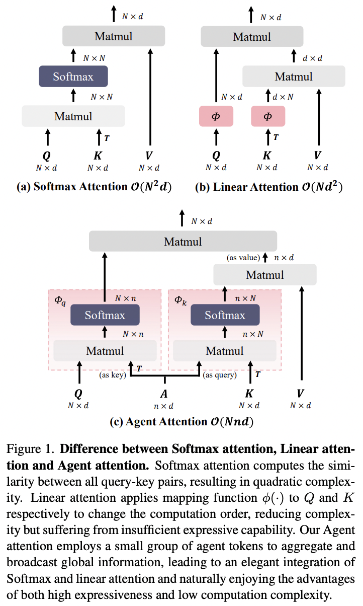

</img>

## Agent Attention - Pytorch

Implementation of <a href="https://arxiv.org/abs/2312.08874">Agent Attention</a> in Pytorch.

This work seems to be an elegant simplification of <a href="https://github.com/lucidrains/isab-pytorch">`ISAB`</a> architecture from the <a href="https://arxiv.org/abs/1810.00825">Set Transformers</a> paper (requires only one attention block rather than two). While ISAB works, I have found it to be a bit unstable, thus wondering if the simplification in this work resolves that issue.

This repository will add support for variable sequence lengths (masking) and post-softmax talking heads.

## Appreciation

- <a href="https://a16z.com/supporting-the-open-source-ai-community/">A16Z Open Source AI Grant Program</a> and <a href="https://huggingface.co/">🤗 Huggingface</a> for the generous sponsorships, as well as my other sponsors, for affording me the independence to open source current artificial intelligence research

## Install

```bash
$ pip install agent-attention-pytorch
```

## Usage

```python
import torch
from agent_attention_pytorch import AgentSelfAttention

attn = AgentSelfAttention(
    dim = 512,
    num_agent_tokens = 256,       # number of "agent" tokens
    dim_head = 64,                # attention head dimension
    heads = 8                     # number of heads
)

x = torch.randn(2, 65536, 512)
mask = torch.ones(2, 65536).bool()

out = attn(x, mask = mask)

assert out.shape == x.shape
```

For a full fledged linear transformer based on agent tokens, just import `AgentTransformer`

```python
import torch
from agent_attention_pytorch import AgentTransformer

transformer = AgentTransformer(
    dim = 512,
    depth = 6,
    num_agent_tokens = 128,
    dim_head = 64,
    heads = 8
)

x = torch.randn(2, 65536, 512)
mask = torch.ones(2, 65536).bool()

out, agent_tokens = transformer(x, mask = mask)

# (2, 65536, 512), (2, 128, 512)
assert out.shape == x.shape
```

## Citations

```bibtex
@inproceedings{Han2023AgentAO,
    title   = {Agent Attention: On the Integration of Softmax and Linear Attention},
    author  = {Dongchen Han and Tianzhu Ye and Yizeng Han and Zhuofan Xia and Shiji Song and Gao Huang},
    year    = {2023},
    url     = {https://api.semanticscholar.org/CorpusID:266210414}
}
```

```bibtex
@misc{shazeer2020talkingheads,
    title   = {Talking-Heads Attention}, 
    author  = {Noam Shazeer and Zhenzhong Lan and Youlong Cheng and Nan Ding and Le Hou},
    year    = {2020},
    eprint  = {2003.02436},
    archivePrefix = {arXiv},
    primaryClass = {cs.LG}
}
```

```bibtex
@article{Bondarenko2023QuantizableTR,
    title   = {Quantizable Transformers: Removing Outliers by Helping Attention Heads Do Nothing},
    author  = {Yelysei Bondarenko and Markus Nagel and Tijmen Blankevoort},
    journal = {ArXiv},
    year    = {2023},
    volume  = {abs/2306.12929},
    url     = {https://api.semanticscholar.org/CorpusID:259224568}
}
```

```bibtex
@article{Wang2022FoundationT,
    title   = {Foundation Transformers},
    author  = {Hongyu Wang and Shuming Ma and Shaohan Huang and Li Dong and Wenhui Wang and Zhiliang Peng and Yu Wu and Payal Bajaj and Saksham Singhal and Alon Benhaim and Barun Patra and Zhun Liu and Vishrav Chaudhary and Xia Song and Furu Wei},
    journal = {ArXiv},
    year    = {2022},
    volume  = {abs/2210.06423},
    url     = {https://api.semanticscholar.org/CorpusID:252846241}
}
```
